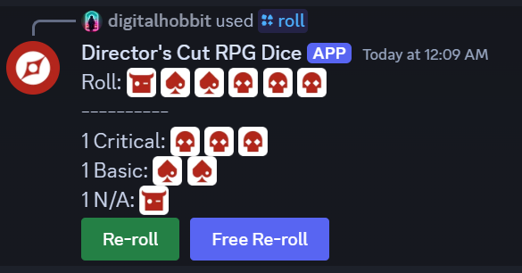

# Director's Cut RPG Discord Bot
A Discord dice bot for tabletop RPGs using the Director's Cut system, such as Outgunned and Household.

## Usage

Invite the bot to your Discord server by clicking on [this link](https://discord.com/oauth2/authorize?client_id=1312603605832040568&permissions=10240&integration_type=0&scope=bot).

Once added, the bot exposes several slash commands:

### `/help`

Shows a brief help text.

### `/roll <num_dice>`

Rolls the specified number of dice.

The resulting messages shows the raw dice roll results (sorted so it's easier to visually identify matches).
In addition, all successes are listed below in order of decreasing magnitude (e.g. extreme, critical, basic).

Below, buttons to perform a _Re-roll_, _Free Re-roll_, or to go _All In_ are shown if applicable, as per the
Director System rules. Note that a _Free Re-roll_ is typically only allowed if the character possesses a Feat
(or equivalent, depending on the specific game) that allows a free re-roll in the specific circumstance.

After performing a _Re-roll_, _Free Re-roll_, _All In_, the message is updated to show the new result, as well as
the updated successes. A thumbs-up indicates that the re-roll improved the result. A thumbs-down indicates that
the roll did not improve the result, which means that either a single success (in case of a _Re-roll_) or all
successes (in case of going _All In_) were lost. The lost
successes are shown below.

### `/coin`

Flips a coin. This can be used for Outgunned's spotlight coins, for example.

### `/d6`

Rolls a single d6. This can be used for Outgunned's death roulette, for example.

### `/settings <dice_set>`

Sets the dice set to use for the current channel. The following dice sets are currently supported:
* Outgunned (default)
* Outgunned Adventure
* Household
* Numbers

The changes are purely visual, in the form of different dice emojis. There are no mechnical differences between the dice sets.

## Future Improvements

None currently planned. Please feel free to submit an issue with your feature request.

## Development

These instructions are mainly relevant if you want to tweak or extend the bot.

The bot is written in Python 3 and uses [Poetry](https://python-poetry.org/) for package management.

1. Clone the repository
2. Create a new Discord Application in the [Discord Developer Portal](https://discord.com/developers/applications).
   Create a token for your application and note this down somewhere safe.
3. Create a `.env` file by copying `.env.example` and filling in the fields. Only the token is required.
   You can optionally enter your own Discord server's id as the developer guild id. This will ensure any
   new commands are immediately registered on the server, without the normal up to one hour delay.
4. Install Python 3 and Poetry according to the setup instructions for your respective system
5. Run `poetry install` to install all dependencies
6. Run `poetry run python -m bot.bot` to start the bot
7. Generate an OAuth2 invite URL using the developer portal. Ensure that the `bot` scope and the
   `Send Messages` and `Manage Messages` bot permissions are checked.
8. Open the URL in a browser and select a Discord server to invite the bot to it.

## Changelog

| Version | Description |
|---------|-------------|
| v0.1.0  | Initial release |
| v0.2.0  | Added `/settings` command to change dice sets |
